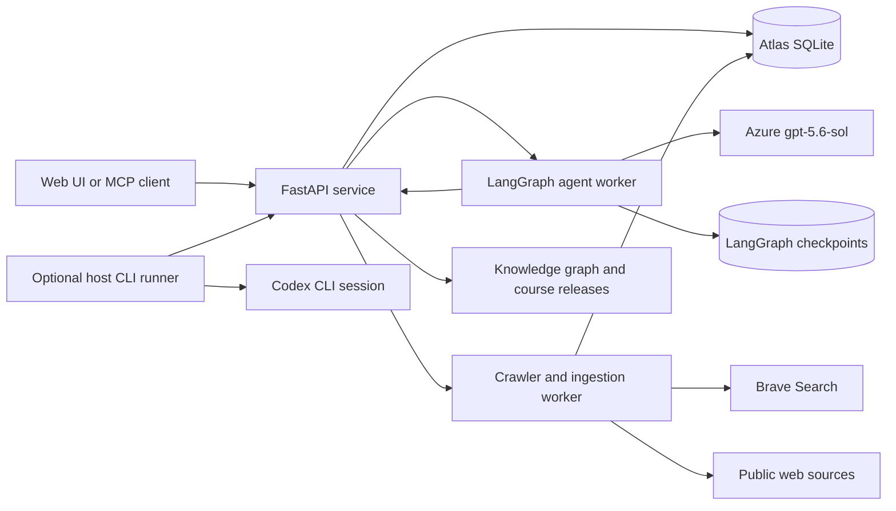

# Atlas Research

Atlas Research is a local-first research and learning application that turns a topic into cited notes, a knowledge graph, and an indexed multi-page course. Local LangGraph workflows coordinate planning, parallel research, evidence validation, review, gap correction, course generation, and documentation autoresearch. Azure supplies model inference through `gpt-5.6-sol`; Atlas owns the durable workflow, source retrieval, provenance, budgets, and published output.

The default deployment is private to the local computer. The web application and API bind to `127.0.0.1`, credentials stay in environment variables, and project data is stored in local SQLite files outside the containers.

## Contents

- [What Atlas does](#what-atlas-does)
- [Architecture](#architecture)
- [Repository layout](#repository-layout)
- [Prerequisites](#prerequisites)
- [Quick deployment](#quick-deployment)
- [Configuration](#configuration)
- [Operating the deployment](#operating-the-deployment)
- [Backups and recovery](#backups-and-recovery)
- [Using Atlas](#using-atlas)
- [MCP and CLI integration](#mcp-and-cli-integration)
- [Development setup](#development-setup)
- [Testing](#testing)
- [Database and migrations](#database-and-migrations)
- [Security model](#security-model)
- [Troubleshooting](#troubleshooting)
- [Git and release workflow](#git-and-release-workflow)

## What Atlas does

- Accepts a research topic, learning goal, and learner level.
- Uses LangGraph to plan and execute parallel research tasks.
- Uses `gpt-5.6-sol` for every in-house role: planner, researcher, reviewer, gap fixer, course architect, page writer, and documentation evaluator.
- Discovers sources with Brave Search when configured.
- Crawls public HTML, PDF, and text sources through a protected retrieval service.
- Validates submitted quotations against independently fetched source text.
- Stores claims with explicit provenance: `source_supported`, `llm_synthesis`, `llm_hypothesis`, or `user_authored`.
- Builds an evolving knowledge graph from supported concepts and relationships.
- Generates versioned, searchable documentation with chapters, breadcrumbs, page navigation, citations, provenance, and exports.
- Lets a learner request missing coverage from any course page. Atlas checks the existing course and graph before creating new research tasks.
- Runs documentation autoresearch experiments and keeps only evidence-safe, non-regressing improvements.
- Retains task, execution, cost, source, and model audit information.
- Supports an optional authenticated Codex CLI fallback without requiring an LLM API key for that fallback.

Agent output is never evidence by itself. Cross-agent agreement can influence review priority, but only source text fetched and validated by Atlas can support a factual claim.

## Architecture



The default Docker deployment starts four services:

| Service | Responsibility | Local port |
| --- | --- | --- |
| `web` | Next.js interface for research, sources, runs, graphs, evidence, and documentation | `3000` |
| `api` | FastAPI, MCP, orchestration records, course APIs, and SQLite persistence | `8000` |
| `worker` | Search discovery, crawling, extraction, source chunking, and embeddings | none |
| `agent-worker` | LangGraph execution, Azure inference, review, gap correction, and documentation experiments | none |

Two persistence layers are intentionally separate:

- `data/research.db` is authoritative for projects, runs, tasks, evidence, graph records, pages, releases, settings, and audits.
- `data/langgraph-checkpoints.db` stores resumable LangGraph state and interrupts.

The optional host runner stays outside Docker so it can access authenticated Windows CLI sessions. It is not required for the in-house Azure/LangGraph workflow.

## Repository layout

```text
.
├── apps/
│   ├── api/                 FastAPI, workers, LangGraph runtime, and tests
│   ├── web/                 Next.js application
│   ├── runner/              Optional host-side Codex CLI runner
│   └── mcp-bridge/          Stdio-to-local-HTTP MCP bridge
├── data/                    Local SQLite databases; ignored by Git
├── .local/                  Local installation token; ignored by Git
├── scripts/start-local.mjs  One-command local launcher
├── docker-compose.yml       Local service definition
├── .env.example             Safe configuration template
└── package.json             Root operational commands
```

## Prerequisites

### Required for the recommended deployment

- Windows 10/11, macOS, or Linux.
- Docker Desktop or Docker Engine with Compose v2.
- Node.js 20 or newer. The web container itself uses Node.js 22.
- An Azure OpenAI-compatible endpoint and key.
- An Azure deployment named `gpt-5.6-sol`, or environment variables pointing both Atlas deployment settings to the actual deployment name.
- At least 8 GB of available memory. More memory is useful when the local embedding model is loaded.
- Enough disk space for Docker images, source text, execution logs, and course versions.

### Recommended

- A Brave Search API key for predictable discovery of sources on completely new topics.
- Git for updates and normal development.
- Python 3.12 if the API will be run directly rather than in Docker.
- A logged-in Codex CLI only if the optional CLI fallback will be used.

### Verify the toolchain

```powershell
docker --version
docker compose version
node --version
git --version
```

On macOS or Linux, use the same commands in a POSIX shell.

## Quick deployment

### 1. Clone and enter the repository

```powershell
git clone https://github.com/Tanmays9/Autoresearch-Agentic-App.git
Set-Location Autoresearch-Agentic-App
```

### 2. Create the local configuration

PowerShell:

```powershell
Copy-Item .env.example .env
notepad .env
```

macOS or Linux:

```bash
cp .env.example .env
${EDITOR:-vi} .env
```

Set at least:

```dotenv
AZURE_OPENAI_ENDPOINT=https://YOUR_RESOURCE.openai.azure.com/
AZURE_OPENAI_API_KEY=YOUR_LOCAL_SECRET
AZURE_RESEARCH_DEPLOYMENT=gpt-5.6-sol
AZURE_REASONING_DEPLOYMENT=gpt-5.6-sol
```

Optionally enable web discovery:

```dotenv
BRAVE_SEARCH_API_KEY=YOUR_LOCAL_SECRET
```

Do not commit `.env`. It is already ignored by Git.

### 3. Start Atlas

```powershell
npm run local
```

This command:

1. Creates `data/` if it does not exist.
2. Generates a random local installation token at `.local/token` if needed.
3. builds and starts the four Docker services;
4. waits for the API health check;
5. prints the local URLs; and
6. starts the optional host CLI runner in the foreground.

Leave this terminal open if the Codex CLI fallback should remain available. Closing it stops the host runner but does not stop the Docker services.

If only the in-house Azure agents are needed, run `npm run local` once and press `Ctrl+C` after the services become healthy. That stops the foreground host runner while the Docker services continue running. Later Docker-only starts can use:

```powershell
docker compose up -d --build
```

### 4. Verify the deployment

```powershell
docker compose ps
Invoke-RestMethod http://127.0.0.1:8000/health
```

POSIX equivalent:

```bash
docker compose ps
curl --fail http://127.0.0.1:8000/health
```

Expected health response:

```json
{"status":"ok"}
```

Open:

- Web application: <http://127.0.0.1:3000>
- API documentation: <http://127.0.0.1:8000/docs>
- API health: <http://127.0.0.1:8000/health>
- MCP endpoint: `http://127.0.0.1:8000/mcp`

### 5. Verify Azure readiness

Open **Agent runs** in the web application. The in-house Azure provider should report ready and show `gpt-5.6-sol` as the deployment. A readiness test is also available through the agent settings API and UI.

If Azure is not ready, see [Azure reports not ready](#azure-reports-not-ready).

## Configuration

Configuration is loaded from `.env` by Docker Compose and the Python settings layer. Secrets must stay in `.env` or the host environment.

### Core settings

| Variable | Default | Purpose |
| --- | --- | --- |
| `API_PORT` | `8000` | Host port for FastAPI; bound to `127.0.0.1` |
| `WEB_PORT` | `3000` | Host port for Next.js; bound to `127.0.0.1` |
| `NEXT_PUBLIC_API_URL` | `http://127.0.0.1:8000` | API URL embedded in the web build |
| `DATABASE_URL` | `sqlite:////app/data/research.db` | Authoritative Atlas database inside containers |
| `LOCAL_TOKEN_FILE` | `/app/.local/token` | Local runner/MCP authentication token path inside containers |
| `ENABLE_EMBEDDINGS` | `true` | Enables local semantic matching and source relevance |
| `EMBEDDING_MODEL` | `BAAI/bge-small-en-v1.5` | FastEmbed model; downloaded lazily on first use |

### Azure settings

| Variable | Default | Purpose |
| --- | --- | --- |
| `AZURE_OPENAI_ENDPOINT` | empty | Azure endpoint; required for in-house agents |
| `AZURE_OPENAI_API_KEY` | empty | Azure credential; required for in-house agents |
| `AZURE_OPENAI_API_VERSION` | `2025-04-01-preview` | Azure API version used by the LangChain client |
| `AZURE_RESEARCH_DEPLOYMENT` | `gpt-5.6-sol` | Deployment used by research roles |
| `AZURE_REASONING_DEPLOYMENT` | `gpt-5.6-sol` | Deployment used by planning, review, and evaluation roles |
| `AZURE_TOKEN_BUDGET` | `1000000` | Default maximum tokens available to a deep research run |
| `AZURE_COST_BUDGET_USD` | `50` | Default application-side cost ceiling per run |
| `AZURE_RESEARCH_COST_PER_MILLION_TOKENS` | `10` | Local estimate used for budget reporting |
| `AZURE_REASONING_COST_PER_MILLION_TOKENS` | `10` | Local estimate used for budget reporting |

The cost settings are local estimates, not Azure billing data. Confirm actual model pricing and quota in the Azure portal.

Atlas currently enforces a single-model policy: both deployment variables should point to `gpt-5.6-sol`. Do not substitute a smaller model unless the application policy and tests are intentionally changed.

### Agent and documentation settings

| Variable | Default | Purpose |
| --- | --- | --- |
| `INHOUSE_AGENT_CONCURRENCY` | `5` | Maximum concurrent in-house agent tasks |
| `INHOUSE_TOOL_ROUNDS` | `6` | Maximum tool rounds per researcher |
| `INHOUSE_RUN_DEADLINE_MINUTES` | `90` | Default deep-research deadline |
| `DOCUMENTATION_EXPERIMENT_BUDGET` | `12` | Maximum autoresearch experiments per documentation run |
| `LANGGRAPH_CHECKPOINT_PATH` | `/app/data/langgraph-checkpoints.db` | Resumable LangGraph checkpoint database |

Research source limits, crawler concurrency, Codex concurrency, and automatic evidence/publication policies are also persisted in Atlas settings and can be changed through the web interface or settings APIs.

### Discovery settings

| Variable | Default | Purpose |
| --- | --- | --- |
| `BRAVE_SEARCH_API_KEY` | empty | Enables predictable web discovery |

Without Brave, Atlas still works with already stored sources, manually supplied URLs, and source candidates produced during research. Completely new topics will have less reliable discovery until Brave is configured.

### Optional host-runner settings

| Variable | Default | Purpose |
| --- | --- | --- |
| `ATLAS_ROOT` | repository root | Overrides the root used to find `.local/token` |
| `ATLAS_API_URL` | `http://127.0.0.1:8000` | API used by the runner or MCP bridge |
| `ATLAS_ENABLED_PROVIDERS` | `codex` | Comma-separated CLI providers enabled by the host runner |
| `ATLAS_LIVE_SMOKE` | unset | Must equal `1` to permit a subscription-backed smoke test |

## Operating the deployment

### Show service status

```powershell
docker compose ps
```

### Follow logs

All services:

```powershell
docker compose logs -f --tail 200
```

One service:

```powershell
docker compose logs -f --tail 200 agent-worker
docker compose logs -f --tail 200 worker
docker compose logs -f --tail 200 api
docker compose logs -f --tail 200 web
```

### Restart services

```powershell
docker compose restart
```

Restart only the LangGraph worker after an agent-runtime change:

```powershell
docker compose restart agent-worker
```

### Rebuild after source changes

```powershell
docker compose up -d --build
```

Rebuild a single service:

```powershell
docker compose build api agent-worker worker
docker compose up -d api agent-worker worker
```

### Stop Atlas

Stop containers without deleting them:

```powershell
docker compose stop
```

Stop and remove containers and the Compose network:

```powershell
docker compose down
```

The databases remain in `data/` because they are bind-mounted from the workspace. Do not delete `data/` unless the research history is intentionally being erased.

### Update an existing deployment

1. Ensure the working tree is clean.
2. Back up both SQLite databases.
3. Pull the new code.
4. rebuild the services;
5. verify health and logs.

```powershell
git status --short
git pull --ff-only
docker compose up -d --build
docker compose ps
Invoke-RestMethod http://127.0.0.1:8000/health
```

Additive schema migrations run when the API initializes. Keep a backup when moving between revisions.

### Change ports

Set alternative ports in `.env`:

```dotenv
API_PORT=8100
WEB_PORT=3100
NEXT_PUBLIC_API_URL=http://127.0.0.1:8100
```

Because `NEXT_PUBLIC_API_URL` is embedded during the Next.js build, rebuild `web` after changing it:

```powershell
docker compose build web
docker compose up -d web
```

## Backups and recovery

Atlas uses SQLite write-ahead logging while active. Copying only a live `.db` file can omit recent WAL data, so use SQLite's backup API or stop all writers first.

### Online backup

Create consistent backups while Atlas is running:

```powershell
docker compose exec -T api python -c "import sqlite3; s=sqlite3.connect('/app/data/research.db'); d=sqlite3.connect('/app/data/research-backup.db'); s.backup(d); d.close(); s.close()"
docker compose exec -T agent-worker python -c "import sqlite3; s=sqlite3.connect('/app/data/langgraph-checkpoints.db'); d=sqlite3.connect('/app/data/langgraph-checkpoints-backup.db'); s.backup(d); d.close(); s.close()"
```

Copy these two backup files from `data/` to normal backup storage:

- `data/research-backup.db`
- `data/langgraph-checkpoints-backup.db`

The local installation token at `.local/token` can also be backed up securely. Never publish it or commit it.

### Restore

Restoring replaces active local state. Stop all services first, copy the desired backup files outside `data/`, and preserve the complete current `data` directory under a separate name before proceeding. The following example uses `C:\Backups\Atlas` as the external backup location:

```powershell
docker compose down
$archive = "data-before-restore-$(Get-Date -Format 'yyyyMMdd-HHmmss')"
Move-Item -LiteralPath (Resolve-Path .\data) -Destination $archive
New-Item -ItemType Directory -Path .\data | Out-Null
Copy-Item -LiteralPath C:\Backups\Atlas\research-backup.db -Destination .\data\research.db
Copy-Item -LiteralPath C:\Backups\Atlas\langgraph-checkpoints-backup.db -Destination .\data\langgraph-checkpoints.db
docker compose up -d
```

Then verify `/health`, inspect the API and agent-worker logs, and open a known project. Keep the timestamped archive until the restored installation has been fully verified.

## Using Atlas

### Start a research project

1. Open <http://127.0.0.1:3000>.
2. Enter a topic in **Research any topic**.
3. Set the learning goal and level when available.
4. Start research.
5. Watch planning, research, review, follow-up, and documentation work in **Agent runs**.

A normal in-house run uses bounded planning, parallel research, evidence validation, an independent fresh reviewer session, and at most the configured follow-up depth.

### Add missing course coverage

Open a course page and use **What is missing from this course?**. Atlas will:

1. compare the request with existing page summaries and graph concepts;
2. return no work when the material is already substantially covered;
3. create precise missing topics when needed;
4. dispatch them to parallel LangGraph researchers;
5. verify submitted citations;
6. run automatic review and bounded gap correction; and
7. generate an expanded course release.

### Evidence and publication policy

- Verified quotations and supported claims are incorporated automatically.
- Verified single-source claims remain explicitly attributable to that source.
- Unsupported statements are excluded from factual pages.
- Unresolved material remains visible in unresolved-question and audit surfaces.
- Conflicts are handled conservatively and preserved in the audit record.
- Documentation autoresearch keeps only candidates that pass deterministic checks, do not regress evidence, and improve the quality score by at least five points.
- Automatic publication is enabled by default for qualifying documentation candidates. It can be disabled in research settings to restore approval-gated publication.

### Course output

Generated documentation provides:

- an indexed landing page and hierarchical chapter sidebar;
- multi-page documentation routes;
- breadcrumbs and previous/next navigation;
- a per-page table of contents;
- full-text and semantic search;
- draft and published versions;
- citations, bibliography, and provenance;
- unresolved questions;
- Markdown export; and
- multi-file ZIP export.

## MCP and CLI integration

### MCP endpoint

The local Streamable HTTP endpoint is:

```text
http://127.0.0.1:8000/mcp
```

It requires the generated local token in the `x-local-token` header. Prefer the included stdio bridge so clients never need the raw token in their configuration.

### Stdio bridge configuration

Use an absolute repository path:

```json
{
  "name": "atlas-research",
  "command": "node",
  "args": [
    "C:/absolute/path/to/Autoresearch-Agentic-App/apps/mcp-bridge/index.mjs"
  ]
}
```

The bridge reads `.local/token` and forwards JSON-RPC messages to the localhost MCP endpoint.

Kiro can use the configuration through its MCP server settings when installed. A compatible client can then request actions such as:

> Create a research topic for QLoRA evaluation and start immediately.

### Optional Codex host runner

Start only the host runner after the API is healthy:

```powershell
npm run runner
```

The runner:

- discovers installed CLI capabilities;
- uses the provider's existing login session;
- claims Atlas tasks through authenticated localhost APIs;
- passes prompts through stdin;
- uses argument arrays with no shell;
- streams sanitized events back to Atlas; and
- never uses permission-bypass flags.

The in-house LangGraph worker remains the default research engine. Codex is an optional fallback or explicitly selected provider.

## Development setup

### Recommended development loop: Docker

The most reproducible loop is:

```powershell
docker compose up -d --build
docker compose logs -f --tail 100 api agent-worker worker web
```

After editing API or worker code:

```powershell
docker compose build api worker agent-worker
docker compose up -d api worker agent-worker
```

After editing the web application:

```powershell
docker compose build web
docker compose up -d web
```

### Run the Python API directly

Python 3.12 or newer is required.

From the repository root in PowerShell:

```powershell
py -3.12 -m venv .venv
.\.venv\Scripts\Activate.ps1
python -m pip install --upgrade pip
python -m pip install -e ".\apps\api[dev]"
python -m uvicorn app.main:app --app-dir apps/api --reload --host 127.0.0.1 --port 8000
```

Running from the repository root lets the settings layer read the root `.env`, `data/`, and `.local/token` paths.

To run the non-agent worker in another PowerShell terminal:

```powershell
.\.venv\Scripts\Activate.ps1
$env:PYTHONPATH = (Resolve-Path .\apps\api)
python -m app.worker
```

To run the LangGraph agent worker directly:

```powershell
.\.venv\Scripts\Activate.ps1
$env:PYTHONPATH = (Resolve-Path .\apps\api)
$env:LANGGRAPH_CHECKPOINT_PATH = (Join-Path (Resolve-Path .\data) "langgraph-checkpoints.db")
python -m app.agent_worker
```

Do not run a direct worker and its Docker counterpart against the same task queue unless concurrent worker behavior is specifically being tested.

### Run the web application in development mode

Stop the production web container if it owns port 3000:

```powershell
docker compose stop web
Set-Location apps\web
npm install
$env:NEXT_PUBLIC_API_URL = "http://127.0.0.1:8000"
npm run dev
```

The page is then available at <http://127.0.0.1:3000> with Next.js hot reload.

### Run the host runner directly

From the repository root, with the API healthy and `.local/token` present:

```powershell
$env:ATLAS_ENABLED_PROVIDERS = "codex"
npm run runner
```

### Important implementation boundaries

- Atlas SQLite is authoritative. LangGraph checkpoints do not replace task and evidence records.
- Agents use role-approved tools rather than direct filesystem, command, database, or arbitrary network access.
- All web retrieval goes through the crawler.
- Provider credentials remain environment-only.
- Agent submissions pass through schema validation and evidence verification before affecting factual pages or the graph.
- Add schema changes through additive migrations in `apps/api/app/migrations.py`.
- Preserve existing data and API behavior unless a migration or versioned interface explicitly changes it.

## Testing

### Full API suite in Docker

```powershell
docker compose run --rm api python -m pytest -q
```

### One API test module

```powershell
docker compose run --rm api python -m pytest -q tests/test_course_expansion.py
```

### API tests without Docker

```powershell
.\.venv\Scripts\Activate.ps1
Set-Location apps\api
python -m pytest -q
```

The test fixture uses isolated temporary databases and tokens. Normal tests do not need Azure, Brave, or an LLM subscription.

### Runner tests

```powershell
npm run test:runner
```

These tests cover structured output parsing, stdin prompt delivery, event sanitization, and MCP configuration.

### Web checks

```powershell
Set-Location apps\web
npm install
npm run typecheck
npm run build
```

The production container build also performs the Next.js build:

```powershell
docker compose build web
```

### Opt-in live Codex smoke test

This test can consume the logged-in Codex subscription and is disabled unless explicitly enabled:

```powershell
$env:ATLAS_LIVE_SMOKE = "1"
npm run smoke:codex
Remove-Item Env:ATLAS_LIVE_SMOKE
```

Do not run subscription-backed smoke tests in normal CI.

### Suggested validation before a commit

```powershell
docker compose run --rm api python -m pytest -q
npm run test:runner
docker compose build web
git diff --check
git status --short
```

## Database and migrations

The API initializes SQLAlchemy tables and applies versioned additive migrations during startup. Migration code lives in:

```text
apps/api/app/migrations.py
```

Guidelines:

- Add new fields and tables without destroying existing project data.
- Make every migration safe to execute once and detectable afterward.
- Test upgrades against a copy of a realistic database.
- Back up both SQLite databases before a release upgrade.
- Never edit or commit the live files under `data/`.

SQLite is appropriate for the current local single-installation model. A different database should be introduced only with explicit migration and concurrency planning.

## Security model

- The API and web ports bind to `127.0.0.1` by default.
- The deployment is not configured for remote or multi-user exposure.
- `.env`, `.local/`, and `data/` are ignored by Git.
- Azure and Brave credentials remain environment-only.
- Runner and MCP mutations require a randomly generated local token.
- CLI programs are spawned with argument arrays and `shell: false`.
- Prompts are passed through stdin, not command arguments.
- Permission-bypass flags are prohibited.
- Execution output is sanitized and capped before persistence.
- Private reasoning, authentication data, and unsanitized local paths are not shown in the UI.
- Crawling enforces public-address validation on redirects, robots rules, response-size limits, domain limits, depth limits, deduplication, and deadlines.
- Retrieved pages and model output are treated as untrusted content and cannot expand tool permissions or budgets.
- Agents cannot directly publish, modify the database, execute commands, or fetch arbitrary URLs.
- Published factual content must be evidence-supported or explicitly user-authored.

Do not expose ports 3000 or 8000 on `0.0.0.0` without adding real user authentication, TLS, authorization, rate limiting, and a reviewed deployment architecture.

## Troubleshooting

### Azure reports not ready

Check that `.env` contains non-empty values and that the deployment exists:

```dotenv
AZURE_OPENAI_ENDPOINT=https://YOUR_RESOURCE.openai.azure.com/
AZURE_OPENAI_API_KEY=YOUR_LOCAL_SECRET
AZURE_RESEARCH_DEPLOYMENT=gpt-5.6-sol
AZURE_REASONING_DEPLOYMENT=gpt-5.6-sol
```

Recreate the services after changing `.env`:

```powershell
docker compose up -d --force-recreate api agent-worker
docker compose logs --tail 200 agent-worker
```

Common causes are an incorrect endpoint, wrong deployment name, unsupported API version, expired key, quota exhaustion, or an Azure rate limit.

### Research starts but discovers no new web sources

Verify `BRAVE_SEARCH_API_KEY`. Without Brave, provide source URLs manually or use topics for which Atlas already has sources. Inspect crawler state under **Sources** and review skipped reasons such as robots denial, non-public addresses, unsupported content, paywalls, or relevance filtering.

### First embedding operation is slow

FastEmbed downloads `BAAI/bge-small-en-v1.5` lazily. The initial semantic operation can therefore take longer and requires network access. Later operations reuse the local model cache. Set `ENABLE_EMBEDDINGS=false` only when semantic matching is intentionally disabled.

### Port 3000 or 8000 is already in use

Change `WEB_PORT`, `API_PORT`, and `NEXT_PUBLIC_API_URL` in `.env`, then rebuild `web`. Alternatively stop the process or container currently holding the port.

```powershell
Get-NetTCPConnection -LocalPort 3000,8000 -ErrorAction SilentlyContinue
```

### Web UI cannot reach the API

Check:

```powershell
Invoke-RestMethod http://127.0.0.1:8000/health
docker compose logs --tail 100 api web
```

If the API port changed, ensure `NEXT_PUBLIC_API_URL` matches and rebuild the web image.

### Agent tasks remain queued

Inspect the agent worker and current settings:

```powershell
docker compose ps agent-worker
docker compose logs --tail 250 agent-worker
```

Confirm Azure readiness, token/cost budgets, the configured concurrency, task deadlines, and whether a previous rate limit is backing off.

### Optional Codex tasks remain queued

Run the host runner in a terminal:

```powershell
npm run runner
```

Confirm that the Codex CLI is installed, logged in, and reported as available. Atlas disables unsafe or unsupported adapters instead of improvising flags.

### MCP client cannot connect

1. Confirm the API health endpoint.
2. Confirm `.local/token` exists.
3. use an absolute bridge path;
4. run `npm run mcp:stdio` manually to surface startup errors; and
5. confirm that the client launches Node.js from an environment where it is on `PATH`.

### Database is locked

Brief SQLite contention is retried by core workflows. Persistent locking usually means extra local processes are using the same database, or a direct development worker is running alongside Docker unexpectedly. Stop duplicate workers and inspect API/worker logs. Do not delete WAL or SHM files while services are running.

### Reset only disposable containers

```powershell
docker compose down
docker compose up -d --build
```

This preserves bind-mounted databases. A full data reset requires intentionally moving or deleting `data/` while all services are stopped; that operation is irreversible unless a backup exists.

## Git and release workflow

### Branch and commit workflow

```powershell
git switch -c feature/short-description
git status --short
git add -- path/to/changed/files
git commit -m "feat(scope): describe the change"
git push -u origin feature/short-description
```

Use focused commits and conventional prefixes such as `feat`, `fix`, `test`, `docs`, `refactor`, and `chore`.

### Before pushing

- Run the relevant API, runner, and web checks.
- Confirm `git diff --check` is clean.
- Inspect `git diff --cached`.
- Confirm `.env`, `.local/`, database files, logs, caches, and build output are not staged.
- Never rewrite shared history unless collaborators have agreed.

### Production scope

The current deployment is designed for one trusted user on one local machine. Scheduling, multi-user access, remote exposure, cloud hosting, browser rendering for JavaScript-only pages, authenticated crawling, and distributed databases require additional design and security work before they should be considered production-ready.

## Current model and provider policy

- In-house research: Azure `gpt-5.6-sol`
- Planning and course architecture: Azure `gpt-5.6-sol`
- Review and documentation evaluation: fresh Azure `gpt-5.6-sol` sessions
- Gap correction: Azure `gpt-5.6-sol`
- Codex CLI: optional manual fallback
- Kiro: optional MCP client when installed
- Gemini and Claude CLI workers: disabled unless installed, authenticated, and capability-validated
- Brave Search: optional external discovery credential

No `gpt-5.4-mini` deployment is used.
